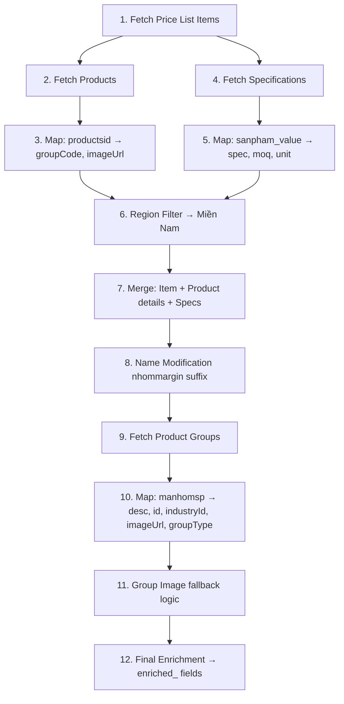

# DATA RULES — Product Catalog

> Tài liệu tổng hợp tất cả quy tắc xử lý, lọc (filter), gộp (merge), sắp xếp (sort) và tính giá (discount) data trong project Product Catalog.
> Nguồn: `crmService.ts`, `catalogGenerator.ts`, `App.tsx`, `types.ts`

---

## 1. Nguồn Dữ Liệu (Data Sources)

| # | Entity (Dataverse)          | File xử lý          | Mô tả                       |
|---|----------------------------|----------------------|------------------------------|
| 1 | `crdfd_baogiachitiets`     | `crmService.ts`      | Price List Items (Báo giá chi tiết) |
| 2 | `crdfd_productses`         | `crmService.ts`      | Products (Sản phẩm)         |
| 3 | `crdfd_productspecifications` | `crmService.ts`   | Product Specifications (Quy cách) |
| 4 | `crdfd_productgroups`      | `crmService.ts`      | Product Groups (Nhóm SP)    |
| 5 | `crdfd_customers`          | `crmService.ts`      | Customers (Khách hàng)      |

**Base URL:** `https://wecare-ii.crm5.dynamics.com/api/data/v9.2`

---

## 2. Pagination — fetchAllPages

- Sử dụng `@odata.nextLink` để tự động fetch tất cả các trang
- Nếu gặp lỗi HTTP giữa chừng → **break loop** nhưng vẫn trả về dữ liệu đã fetch được
- Header bắt buộc: `Prefer: odata.include-annotations="*"` để nhận `FormattedValue`

---

## 3. Filter Rules — Server-side

### 3.1 Customers (`fetchCustomers`)

```
$filter=statecode eq 0
  AND crdfd_trangthaikhtext eq 'Khách Hàng Chính Thức'
  AND crdfd_trangthaicskh ne 283640002
```

| Điều kiện                        | Giải thích                              |
|----------------------------------|-----------------------------------------|
| `statecode eq 0`                 | Chỉ lấy record Active                  |
| `crdfd_trangthaikhtext eq 'Khách Hàng Chính Thức'` | Loại trừ KH tiềm năng |
| `crdfd_trangthaicskh ne 283640002` | Loại trừ trạng thái chăm sóc cụ thể  |

**Expand:** `$expand=crdfd_Tinhthanh($select=cr1bb_vungmien)` — dùng để filter vùng miền client-side.

### 3.2 Price List Items (`fetchCatalogData`)

```
$filter=statecode eq 0
  AND crdfd_trangthaihieuluc ne 191920001
  AND crdfd_pricingdeactive eq 191920001
```

| Điều kiện                           | Giải thích                             |
|-------------------------------------|----------------------------------------|
| `statecode eq 0`                    | Active records only                    |
| `crdfd_trangthaihieuluc ne 191920001` | Loại trừ item hết hiệu lực          |
| `crdfd_pricingdeactive eq 191920001`  | Chỉ lấy item pricing active          |

### 3.3 Products, Specifications, Product Groups

```
$filter=statecode eq 0
```

→ Tất cả chỉ lấy **Active records**.

---

## 4. Filter Rules — Client-side

### 4.1 Region Filter: "Miền Nam"

**Áp dụng cho:** Customers + Price List Items

**Customers:**
```typescript
// Expand từ crdfd_Tinhthanh → lấy label cr1bb_vungmien
const regionName = c.crdfd_Tinhthanh?.["cr1bb_vungmien@OData.Community.Display.V1.FormattedValue"];
return regionName?.toLowerCase().includes("miền nam");
```

**Price List Items:**
```typescript
// Kiểm tra Lookup hoặc OptionSet formatted value
const targetGroup = item["_crdfd_nhomoituong_value@OData.Community.Display.V1.FormattedValue"]
  || item["crdfd_nhomoituong@OData.Community.Display.V1.FormattedValue"]
  || item["_crdfd_nhomoituong_value"];
return targetGroup?.toLowerCase().includes('miền nam');
```

> **Fallback:** Nếu region filter trả về rỗng → dùng **tất cả** price list items.

### 4.2 Industry Filter (App-level)

**File:** `App.tsx` → `updateCatalogData()`

| Filter Key  | Logic                                                                      |
|-------------|----------------------------------------------------------------------------|
| `all`       | Không filter — lấy tất cả products                                        |
| `water`     | `enriched_industry_id === '7c9f66a1-af65-ef11-a670-000d3aa290f1'`         |
| `electric`  | `enriched_industry_id === '0c6ebf33-11c9-4fc6-b236-49f46f9d0b4c'`         |
| `metal`     | **Còn lại** — không thuộc Water và Electric (default)                      |

> **Default Filter:** `metal` (Kim Khí)

---

## 5. Data Merge Pipeline

Thứ tự merge trong `fetchCatalogData()`:



### 5.1 Name Modification Logic (Step 8)

```typescript
// Lấy crdfd_nhommargin → tách bằng space → nối phần sau vào tên SP
// VD: "Margin B1" → suffix = "B1"
// Tên: "Bu lông M8" → "Bu lông M8 - B1"
const parts = marginText.trim().split(' ');
if (parts.length > 1) {
    finalName = `${originalName} - ${parts.slice(1).join(' ')}`;
}
```

### 5.2 Group Image Fallback (Step 11)

1. **Ưu tiên 1:** `cr1bb_filehinhanh` từ Product Group → build URL:
   ```
   https://wecare-ii.crm5.dynamics.com/api/data/v9.0/crdfd_productgroups({id})/cr1bb_filehinhanh/$value
   ```
2. **Ưu tiên 2:** Lấy `cr1bb_imageurl` của sản phẩm đầu tiên trong group
3. **Ưu tiên 3:** Fallback theo keyword tên nhóm (bu lông, ốc, vít, đai ốc)

### 5.3 OptionSet vs String Resolution

Nhiều field có thể là **OptionSet (number)** hoặc **String**. Luôn resolve bằng pattern:

```typescript
const resolvedValue = item["field@OData.Community.Display.V1.FormattedValue"]
  || (typeof item["field"] === 'string' ? item["field"] : undefined);
```

Áp dụng cho: `crdfd_nhommargin`, `cr1bb_nhomhang`, `crdfd_wecare_rewards`.

---

## 6. Sort Rules

### 6.1 Group Sort

```typescript
sortedGroups.sort((a, b) => a.localeCompare(b, 'vi'));
```
→ Sắp xếp nhóm SP theo **alphabet tiếng Việt**.

### 6.2 Product Sort (trong mỗi group)

```typescript
// Default: Vietnamese locale + numeric
nameA.localeCompare(nameB, 'vi', { numeric: true });
```

**Ngoại lệ — "Pát ke Góc":**
```typescript
// Parse số từ tên (regex: /số\s*(\d+)/i) → sort theo numeric
// VD: "Pát ke Góc số 3" < "Pát ke Góc số 12"
```

---

## 7. Discount Calculation

### 7.1 Điều kiện áp dụng

- **Chỉ áp dụng** khi filter = `metal` (Kim Khí)
- Product phải thuộc group có `enriched_group_type` chứa `"Margin builder product"`
- Phải có `selectedCustomer` với `crdfd_wecare_rewards`

### 7.2 Ma trận chiết khấu

| Tier      | B1    | B2    | C1    | C2    | D1    | D2    |
|-----------|-------|-------|-------|-------|-------|-------|
| Diamond   | 1.0%  | 1.5%  | 2.0%  | 2.5%  | 3.5%  | 4.0%  |
| Platinum  | 0.8%  | 1.3%  | 1.8%  | 2.2%  | 3.0%  | 3.5%  |
| Gold      | 0.5%  | 1.0%  | 1.3%  | 2.0%  | 2.5%  | 2.7%  |
| Silver    | 0.0%  | 8.0%  | 1.0%  | 1.5%  | 2.0%  | 2.0%  |

> **Lưu ý:** Silver–B2 = 8% có thể là typo (0.8%?). Cần confirm với business.

### 7.3 Công thức

```
Giá ưu đãi = (GiáKhôngVAT - (GiáKhôngVAT × TỷLệCK)) × (1 + VAT)
```

**Fields:**
- `cr1bb_giakhongvat` → Giá không VAT
- `cr1bb_gtgt` → Thuế suất VAT (0.08 hoặc 0.1)
- `crdfd_nhommargin` → Nhóm margin (B1, B2, C1, C2, D1, D2)
- `crdfd_wecare_rewards` → Hạng KH (Diamond, Platinum, Gold, Silver/New)

### 7.4 Reward Tier Normalization

| Input value                  | Normalized to |
|-----------------------------|---------------|
| Chứa "diamond"             | Diamond       |
| Chứa "platium" hoặc "platinum" | Platium   |
| Chứa "gold"                | Gold          |
| Chứa "silver", "new"       | Silver        |

---

## 8. Page Generation Rules

**File:** `catalogGenerator.ts`

### 8.1 Weight-based Pagination

| Item Type    | Weight |
|--------------|--------|
| Product Row  | 1.0    |
| Table Header | 2.0    |
| Group Header | 3.5    |

**Max weight per page:** `48`

- Nếu tên SP > 50 ký tự → +0.4 weight
- Nếu tên SP > 90 ký tự → +0.4 weight thêm
- Nếu spec > 50 ký tự → +0.3 weight  
- Nếu spec > 90 ký tự → +0.3 weight thêm

### 8.2 Page Structure

```
Cover → Intro → TOC (1-N pages) → Content Pages → Appendix
```

- **TOC:** Tối đa `80` entries/trang
- **Content:** Mỗi group bắt đầu bằng `group_header` + `table_header` + products
- Nếu không đủ chỗ cho header + ít nhất 1 product → **flush sang trang mới**

### 8.3 Cover Image by Filter

| Filter   | Image Source               |
|----------|----------------------------|
| metal    | Google Drive thumbnail ID  |
| electric | Google Drive thumbnail ID  |
| water    | Google Drive thumbnail ID  |
| default  | image2url.com              |

---

## 9. Price Formatting

```typescript
const currencyFormatter = new Intl.NumberFormat('en-US', {
  minimumFractionDigits: 0,
  maximumFractionDigits: 0
});
```

- Giá hiển thị **không có phần thập phân**
- Nếu `crdfd_gia` = null/undefined → hiển thị `"Liên hệ"`

---

## 10. Enriched Fields Map

| Enriched Field           | Nguồn gốc                                             |
|--------------------------|--------------------------------------------------------|
| `enriched_description`   | `cr1bb_kienthuccoban` từ Product Groups                |
| `enriched_group_id`      | `crdfd_productgroupid` từ Product Groups               |
| `enriched_industry_id`   | `_crdfd_cap2_value` từ Product Groups                  |
| `enriched_group_image`   | Calculated (Group File → Product Image → Keyword)      |
| `enriched_group_type`    | `cr1bb_nhomhang` formatted từ Product Groups           |
| `enriched_specification` | `crdfd_quycachacbiet` từ Product Specifications        |
| `enriched_moq`           | `crdfd_moqbanra` từ Product Specifications             |
| `enriched_spec_unit`     | `_crdfd_onvi_value` formatted từ Product Specifications|

---

## 11. Key Technical Patterns

### 11.1 OData Annotation Pattern
```
"field@OData.Community.Display.V1.FormattedValue"
```
→ Luôn ưu tiên `FormattedValue` cho Lookup/OptionSet fields.

### 11.2 Re-fetch After Mutation
> Theo Global Rules: Mọi thao tác Submit/Update → **bắt buộc re-fetch** data để sync UI.

### 11.3 Force Remount on Filter Change
```tsx
key={`${activeFilter}-${isMobile}-${pages.length}-${selectedCustomer?.crdfd_customerid || 'def'}`}
```
→ HTMLFlipBook + TOC sidebar đều dùng `key` prop để **force remount** khi data thay đổi.

---

*Cập nhật lần cuối: 2026-02-11*
